# 🎯 **SI3 RSVP System Frontend Implementation Guide**

## **System Architecture Overview**

The RSVP system frontend follows a modern React architecture with TypeScript, atomic design principles, and seamless integration with the SI3 backend and Sanity CMS.

## **Architecture Diagram**

```mermaid
graph TB
    subgraph "Frontend Application"
        subgraph "Pages Layer"
            EP[Event Detail Page]
            RP[RSVP Management Page]
            AP[Admin Dashboard]
            UP[User Profile Page]
        end
        
        subgraph "Components Layer (Atomic Design)"
            subgraph "Atoms"
                BTN[Button]
                INP[Input]
                BDG[Badge]
                LDR[LoadingSpinner]
            end
            
            subgraph "Molecules"
                RF[RSVPForm]
                SC[StatusCard]
                CB[CapacityBar]
                AC[AttendeeCounter]
            end
            
            subgraph "Organisms"
                RW[RSVPWidget]
                AL[AttendeeList]
                RD[RSVPDashboard]
                EM[EventManager]
            end
        end
        
        subgraph "State Management"
            RC[RSVP Context]
            UC[User Context]
            EC[Event Context]
        end
        
        subgraph "Services Layer"
            AS[API Service]
            CS[Calendar Service]
            ES[Email Service]
            SS[Sanity Service]
        end
    end
    
    subgraph "Backend Services"
        subgraph "SI3 Backend API"
            RA[RSVP API]
            AA[Auth API]
            EA[Email API]
            CA[Calendar API]
        end
        
        subgraph "Sanity CMS"
            GS[Guide Sessions]
            EV[Events]
            CT[Categories]
        end
        
        subgraph "External Services"
            PM[ProtonMail]
            GC[Google Calendar]
            OC[Outlook Calendar]
        end
    end
    
    %% Page to Component connections
    EP --> RW
    EP --> AL
    RP --> RD
    AP --> EM
    
    %% Component hierarchy
    RW --> RF
    RW --> SC
    RW --> CB
    AL --> AC
    RF --> BTN
    RF --> INP
    SC --> BDG
    CB --> LDR
    
    %% State connections
    RC --> RW
    RC --> RD
    UC --> RF
    EC --> RW
    
    %% Service connections
    AS --> RA
    AS --> AA
    CS --> CA
    ES --> EA
    SS --> GS
    SS --> EV
    
    %% External connections
    RA --> PM
    CA --> GC
    CA --> OC
    
    %% Data flow
    EP -.->|Fetch Event Data| SS
    RW -.->|Submit RSVP| AS
    AS -.->|API Calls| RA
    RA -.->|Send Emails| PM
    
    classDef frontend fill:#e1f5fe
    classDef backend fill:#f3e5f5
    classDef external fill:#fff3e0
    
    class EP,RP,AP,UP,BTN,INP,BDG,LDR,RF,SC,CB,AC,RW,AL,RD,EM,RC,UC,EC,AS,CS,ES,SS frontend
    class RA,AA,EA,CA,GS,EV,CT backend
    class PM,GC,OC external
```



## **Technology Stack**

### **Core Technologies**
- **Framework**: Next.js 14+ (App Router)
- **Language**: TypeScript
- **Styling**: Tailwind CSS + CSS Modules
- **State Management**: React Context API + SWR
- **Forms**: React Hook Form + Zod validation
- **HTTP Client**: SWR + Fetch API
- **Calendar**: date-fns for date manipulation

### **Development Tools**
- **Testing**: Jest + React Testing Library
- **Linting**: ESLint + Prettier
- **Type Checking**: TypeScript strict mode
- **Build Tool**: Next.js built-in bundler

## **Project Structure**

```
src/
├── app/                          # Next.js App Router
│   ├── events/
│   │   └── [slug]/
│   │       └── page.tsx         # Event detail page
│   ├── rsvp/
│   │   ├── page.tsx             # RSVP management
│   │   └── admin/
│   │       └── page.tsx         # Admin dashboard
│   └── layout.tsx               # Root layout
├── components/                   # Atomic Design Components
│   ├── atoms/
│   │   ├── Button/
│   │   │   ├── Button.tsx
│   │   │   ├── Button.module.css
│   │   │   └── Button.test.tsx
│   │   ├── Input/
│   │   ├── Badge/
│   │   └── LoadingSpinner/
│   ├── molecules/
│   │   ├── RSVPForm/
│   │   ├── StatusCard/
│   │   ├── CapacityBar/
│   │   └── AttendeeCounter/
│   ├── organisms/
│   │   ├── RSVPWidget/
│   │   ├── AttendeeList/
│   │   ├── RSVPDashboard/
│   │   └── EventManager/
│   └── templates/
│       ├── EventDetailTemplate/
│       └── RSVPManagementTemplate/
├── contexts/                     # React Contexts
│   ├── RSVPContext.tsx
│   ├── UserContext.tsx
│   └── EventContext.tsx
├── services/                     # API Services
│   ├── api.ts                   # Base API client
│   ├── rsvpService.ts           # RSVP operations
│   ├── eventService.ts          # Event operations
│   ├── calendarService.ts       # Calendar integration
│   └── sanityService.ts         # Sanity CMS client
├── types/                       # TypeScript definitions
│   ├── rsvp.ts
│   ├── event.ts
│   ├── user.ts
│   └── api.ts
├── hooks/                       # Custom React hooks
│   ├── useRSVP.ts
│   ├── useEvents.ts
│   └── useAuth.ts
├── utils/                       # Utility functions
│   ├── dateUtils.ts
│   ├── validationSchemas.ts
│   └── constants.ts
└── styles/                      # Global styles
    ├── globals.css
    └── components.css
```

## **Implementation Phases**

### **Phase 1: Foundation Setup (Week 1)**

#### **1.1 Project Initialization**
```bash
# Create Next.js project
npx create-next-app@latest si3-rsvp-frontend --typescript --tailwind --app

# Install dependencies
npm install @hookform/resolvers zod react-hook-form swr date-fns
npm install @sanity/client @sanity/image-url
npm install -D @testing-library/react @testing-library/jest-dom jest-environment-jsdom
```

#### **1.2 Environment Configuration**
```typescript
// .env.local
NEXT_PUBLIC_API_URL=http://localhost:8080
NEXT_PUBLIC_SANITY_PROJECT_ID=your-project-id
NEXT_PUBLIC_SANITY_DATASET=production
SANITY_API_TOKEN=your-api-token
```

#### **1.3 Base Types Setup**
```typescript
// types/rsvp.ts
export enum RSVPStatus {
  ATTENDING = 'attending',
  NOT_ATTENDING = 'not_attending',
  MAYBE = 'maybe',
  WAITLISTED = 'waitlisted'
}

export interface RSVP {
  _id: string;
  eventId: string;
  userId: string;
  status: RSVPStatus;
  guestCount: number;
  dietaryRestrictions?: string;
  specialRequests?: string;
  contactInfo?: {
    phone?: string;
    emergencyContact?: string;
  };
  waitlistPosition?: number;
  createdAt: string;
  updatedAt: string;
}

export interface RSVPStats {
  totalRSVPs: number;
  attending: number;
  notAttending: number;
  maybe: number;
  waitlisted: number;
  totalGuests: number;
  availableSpots: number | null;
  isAtCapacity: boolean;
}
```

### **Phase 2: Core Services (Week 2)**

#### **2.1 API Service Layer**
```typescript
// services/api.ts
class APIClient {
  private baseURL: string;
  
  constructor() {
    this.baseURL = process.env.NEXT_PUBLIC_API_URL || 'http://localhost:8080';
  }
  
  private async request<T>(
    endpoint: string, 
    options: RequestInit = {}
  ): Promise<T> {
    const url = `${this.baseURL}${endpoint}`;
    const token = this.getAuthToken();
    
    const config: RequestInit = {
      headers: {
        'Content-Type': 'application/json',
        ...(token && { Authorization: `Bearer ${token}` }),
        ...options.headers,
      },
      ...options,
    };
    
    const response = await fetch(url, config);
    
    if (!response.ok) {
      throw new Error(`API Error: ${response.status}`);
    }
    
    return response.json();
  }
  
  async get<T>(endpoint: string): Promise<T> {
    return this.request<T>(endpoint);
  }
  
  async post<T>(endpoint: string, data: any): Promise<T> {
    return this.request<T>(endpoint, {
      method: 'POST',
      body: JSON.stringify(data),
    });
  }
  
  async put<T>(endpoint: string, data: any): Promise<T> {
    return this.request<T>(endpoint, {
      method: 'PUT',
      body: JSON.stringify(data),
    });
  }
  
  async delete<T>(endpoint: string): Promise<T> {
    return this.request<T>(endpoint, {
      method: 'DELETE',
    });
  }
  
  private getAuthToken(): string | null {
    if (typeof window !== 'undefined') {
      return localStorage.getItem('authToken');
    }
    return null;
  }
}

export const apiClient = new APIClient();
```

#### **2.2 RSVP Service**
```typescript
// services/rsvpService.ts
import { apiClient } from './api';
import { RSVP, RSVPStats } from '@/types/rsvp';

export class RSVPService {
  static async createRSVP(data: Partial<RSVP>): Promise<RSVP> {
    const response = await apiClient.post<{data: RSVP}>('/api/rsvp', data);
    return response.data;
  }
  
  static async updateRSVP(id: string, data: Partial<RSVP>): Promise<RSVP> {
    const response = await apiClient.put<{data: RSVP}>(`/api/rsvp/${id}`, data);
    return response.data;
  }
  
  static async deleteRSVP(id: string): Promise<void> {
    await apiClient.delete(`/api/rsvp/${id}`);
  }
  
  static async getUserRSVPs(params?: {
    page?: number;
    limit?: number;
    status?: string;
  }): Promise<{rsvps: RSVP[]; pagination: any}> {
    const queryParams = new URLSearchParams();
    if (params?.page) queryParams.append('page', params.page.toString());
    if (params?.limit) queryParams.append('limit', params.limit.toString());
    if (params?.status) queryParams.append('status', params.status);
    
    const response = await apiClient.get<{data: any}>(`/api/rsvp/my-rsvps?${queryParams}`);
    return response.data;
  }
  
  static async getEventStats(eventId: string): Promise<RSVPStats> {
    const response = await apiClient.get<{data: {stats: RSVPStats}}>(`/api/rsvp/event/${eventId}/stats`);
    return response.data.stats;
  }
  
  static async downloadCalendar(rsvpId: string, format: 'ics' | 'google' | 'outlook' = 'ics'): Promise<void> {
    const url = `${process.env.NEXT_PUBLIC_API_URL}/api/rsvp/${rsvpId}/calendar?format=${format}`;
    window.open(url, '_blank');
  }
}
```

### **Phase 3: Atomic Components (Week 3)**

#### **3.1 Button Atom**
```typescript
// components/atoms/Button/Button.tsx
import { ButtonHTMLAttributes, forwardRef } from 'react';
import styles from './Button.module.css';

interface ButtonProps extends ButtonHTMLAttributes<HTMLButtonElement> {
  variant?: 'primary' | 'secondary' | 'outline' | 'danger';
  size?: 'sm' | 'md' | 'lg';
  loading?: boolean;
  fullWidth?: boolean;
}

export const Button = forwardRef<HTMLButtonElement, ButtonProps>(
  ({ 
    variant = 'primary', 
    size = 'md', 
    loading = false, 
    fullWidth = false,
    children, 
    className = '', 
    disabled,
    ...props 
  }, ref) => {
    const buttonClasses = [
      styles.button,
      styles[variant],
      styles[size],
      fullWidth && styles.fullWidth,
      loading && styles.loading,
      className
    ].filter(Boolean).join(' ');

    return (
      <button
        ref={ref}
        className={buttonClasses}
        disabled={disabled || loading}
        {...props}
      >
        {loading && <span className={styles.spinner} />}
        {children}
      </button>
    );
  }
);

Button.displayName = 'Button';
```

#### **3.2 Button Styles**
```css
/* components/atoms/Button/Button.module.css */
.button {
  @apply inline-flex items-center justify-center font-medium rounded-md transition-colors focus:outline-none focus:ring-2 focus:ring-offset-2 disabled:opacity-50 disabled:cursor-not-allowed;
}

.primary {
  @apply bg-blue-600 text-white hover:bg-blue-700 focus:ring-blue-500;
}

.secondary {
  @apply bg-gray-600 text-white hover:bg-gray-700 focus:ring-gray-500;
}

.outline {
  @apply border border-gray-300 bg-white text-gray-700 hover:bg-gray-50 focus:ring-blue-500;
}

.danger {
  @apply bg-red-600 text-white hover:bg-red-700 focus:ring-red-500;
}

.sm {
  @apply px-3 py-1.5 text-sm;
}

.md {
  @apply px-4 py-2 text-base;
}

.lg {
  @apply px-6 py-3 text-lg;
}

.fullWidth {
  @apply w-full;
}

.loading {
  @apply cursor-wait;
}

.spinner {
  @apply animate-spin -ml-1 mr-2 h-4 w-4 border-2 border-white border-t-transparent rounded-full;
}
```

### **Phase 4: Molecule Components (Week 4)**

#### **4.1 RSVP Form Molecule**
```typescript
// components/molecules/RSVPForm/RSVPForm.tsx
import { useForm } from 'react-hook-form';
import { zodResolver } from '@hookform/resolvers/zod';
import { z } from 'zod';
import { RSVPStatus } from '@/types/rsvp';
import { Button } from '@/components/atoms/Button';
import { Input } from '@/components/atoms/Input';

const rsvpSchema = z.object({
  status: z.nativeEnum(RSVPStatus),
  guestCount: z.number().min(1).max(10),
  dietaryRestrictions: z.string().optional(),
  specialRequests: z.string().optional(),
  contactInfo: z.object({
    phone: z.string().optional(),
    emergencyContact: z.string().optional()
  }).optional()
});

type RSVPFormData = z.infer<typeof rsvpSchema>;

interface RSVPFormProps {
  onSubmit: (data: RSVPFormData) => Promise<void>;
  defaultValues?: Partial<RSVPFormData>;
  maxGuests?: number;
  loading?: boolean;
}

export const RSVPForm: React.FC<RSVPFormProps> = ({
  onSubmit,
  defaultValues,
  maxGuests = 5,
  loading = false
}) => {
  const {
    register,
    handleSubmit,
    watch,
    formState: { errors, isSubmitting }
  } = useForm<RSVPFormData>({
    resolver: zodResolver(rsvpSchema),
    defaultValues
  });

  const status = watch('status');
  const showGuestFields = status === RSVPStatus.ATTENDING;

  return (
    <form onSubmit={handleSubmit(onSubmit)} className="space-y-6">
      <div>
        <label className="block text-sm font-medium text-gray-700 mb-2">
          Will you attend?
        </label>
        <select
          {...register('status')}
          className="w-full p-2 border border-gray-300 rounded-md"
        >
          <option value={RSVPStatus.ATTENDING}>Yes, I'll attend</option>
          <option value={RSVPStatus.MAYBE}>Maybe</option>
          <option value={RSVPStatus.NOT_ATTENDING}>Can't attend</option>
        </select>
        {errors.status && (
          <p className="text-red-500 text-sm mt-1">{errors.status.message}</p>
        )}
      </div>

      {showGuestFields && (
        <>
          <Input
            label="Number of Guests (including yourself)"
            type="number"
            min="1"
            max={maxGuests}
            {...register('guestCount', { valueAsNumber: true })}
            error={errors.guestCount?.message}
          />

          <Input
            label="Dietary Restrictions"
            placeholder="e.g., Vegetarian, Gluten-free"
            {...register('dietaryRestrictions')}
            error={errors.dietaryRestrictions?.message}
          />

          <div className="grid grid-cols-1 md:grid-cols-2 gap-4">
            <Input
              label="Phone Number"
              type="tel"
              {...register('contactInfo.phone')}
              error={errors.contactInfo?.phone?.message}
            />
            <Input
              label="Emergency Contact"
              {...register('contactInfo.emergencyContact')}
              error={errors.contactInfo?.emergencyContact?.message}
            />
          </div>
        </>
      )}

      <Button
        type="submit"
        loading={isSubmitting || loading}
        fullWidth
      >
        {defaultValues ? 'Update RSVP' : 'Submit RSVP'}
      </Button>
    </form>
  );
};
```

### **Phase 5: Organism Components (Week 5)**

#### **5.1 RSVP Widget Organism**
```typescript
// components/organisms/RSVPWidget/RSVPWidget.tsx
import { useState } from 'react';
import useSWR from 'swr';
import { RSVPForm } from '@/components/molecules/RSVPForm';
import { StatusCard } from '@/components/molecules/StatusCard';
import { CapacityBar } from '@/components/molecules/CapacityBar';
import { Button } from '@/components/atoms/Button';
import { RSVPService } from '@/services/rsvpService';
import { EventService } from '@/services/eventService';
import { RSVPStatus } from '@/types/rsvp';

interface RSVPWidgetProps {
  eventId: string;
  className?: string;
}

export const RSVPWidget: React.FC<RSVPWidgetProps> = ({ eventId, className = '' }) => {
  const [showForm, setShowForm] = useState(false);
  const [isSubmitting, setIsSubmitting] = useState(false);

  // Fetch event data
  const { data: event } = useSWR(
    `event-${eventId}`,
    () => EventService.getEventById(eventId)
  );

  // Fetch RSVP stats
  const { data: stats, mutate: mutateStats } = useSWR(
    `rsvp-stats-${eventId}`,
    () => RSVPService.getEventStats(eventId),
    { refreshInterval: 30000 }
  );

  // Fetch user's RSVP
  const { data: userRSVP, mutate: mutateUserRSVP } = useSWR(
    `user-rsvp-${eventId}`,
    () => RSVPService.getUserRSVPForEvent(eventId)
  );

  const handleRSVPSubmit = async (formData: any) => {
    setIsSubmitting(true);
    try {
      if (userRSVP) {
        await RSVPService.updateRSVP(userRSVP._id, formData);
      } else {
        await RSVPService.createRSVP({ eventId, ...formData });
      }

      // Refresh data
      await Promise.all([mutateStats(), mutateUserRSVP()]);
      setShowForm(false);
    } catch (error) {
      console.error('RSVP submission failed:', error);
    } finally {
      setIsSubmitting(false);
    }
  };

  const handleCalendarDownload = () => {
    if (userRSVP) {
      RSVPService.downloadCalendar(userRSVP._id);
    }
  };

  if (!event || !stats) {
    return <div className="animate-pulse bg-gray-200 h-64 rounded-lg" />;
  }

  const isRSVPOpen = event.rsvpSettings?.enabled &&
    (!event.rsvpSettings?.rsvpDeadline || new Date(event.rsvpSettings.rsvpDeadline) > new Date());

  return (
    <div className={`space-y-6 ${className}`}>
      {/* Current RSVP Status */}
      {userRSVP && (
        <StatusCard
          rsvp={userRSVP}
          onUpdate={() => setShowForm(true)}
          onDownloadCalendar={handleCalendarDownload}
        />
      )}

      {/* Event Capacity */}
      <CapacityBar
        current={stats.attending}
        maximum={event.rsvpSettings?.maxCapacity}
        waitlistCount={stats.waitlisted}
      />

      {/* RSVP Form or CTA */}
      {showForm ? (
        <div className="bg-white border border-gray-200 rounded-lg p-6">
          <h3 className="text-lg font-semibold mb-4">
            {userRSVP ? 'Update Your RSVP' : 'RSVP for This Event'}
          </h3>
          <RSVPForm
            onSubmit={handleRSVPSubmit}
            defaultValues={userRSVP}
            maxGuests={event.rsvpSettings?.maxGuestsPerRSVP || 5}
            loading={isSubmitting}
          />
          <Button
            variant="outline"
            onClick={() => setShowForm(false)}
            className="mt-4"
          >
            Cancel
          </Button>
        </div>
      ) : (
        !userRSVP && isRSVPOpen && (
          <div className="text-center">
            {stats.isAtCapacity && event.rsvpSettings?.waitlistEnabled ? (
              <Button
                variant="secondary"
                onClick={() => setShowForm(true)}
                fullWidth
              >
                Join Waitlist
              </Button>
            ) : !stats.isAtCapacity ? (
              <Button
                variant="primary"
                onClick={() => setShowForm(true)}
                fullWidth
              >
                RSVP Now
              </Button>
            ) : (
              <div className="bg-gray-50 border border-gray-200 rounded-lg p-4">
                <p className="text-gray-600">This event is at full capacity</p>
              </div>
            )}
          </div>
        )
      )}

      {!isRSVPOpen && (
        <div className="bg-yellow-50 border border-yellow-200 rounded-lg p-4">
          <p className="text-yellow-800 text-sm">
            RSVP is currently closed for this event
          </p>
        </div>
      )}
    </div>
  );
};
```

### **Phase 6: Context & State Management (Week 6)**

#### **6.1 RSVP Context**
```typescript
// contexts/RSVPContext.tsx
import { createContext, useContext, useReducer, ReactNode } from 'react';
import { RSVP, RSVPStats } from '@/types/rsvp';

interface RSVPState {
  userRSVPs: RSVP[];
  eventStats: Record<string, RSVPStats>;
  isLoading: boolean;
  error: string | null;
}

type RSVPAction =
  | { type: 'SET_LOADING'; payload: boolean }
  | { type: 'SET_ERROR'; payload: string | null }
  | { type: 'SET_USER_RSVPS'; payload: RSVP[] }
  | { type: 'ADD_RSVP'; payload: RSVP }
  | { type: 'UPDATE_RSVP'; payload: RSVP }
  | { type: 'REMOVE_RSVP'; payload: string }
  | { type: 'SET_EVENT_STATS'; payload: { eventId: string; stats: RSVPStats } };

const initialState: RSVPState = {
  userRSVPs: [],
  eventStats: {},
  isLoading: false,
  error: null
};

const rsvpReducer = (state: RSVPState, action: RSVPAction): RSVPState => {
  switch (action.type) {
    case 'SET_LOADING':
      return { ...state, isLoading: action.payload };
    case 'SET_ERROR':
      return { ...state, error: action.payload };
    case 'SET_USER_RSVPS':
      return { ...state, userRSVPs: action.payload };
    case 'ADD_RSVP':
      return { ...state, userRSVPs: [...state.userRSVPs, action.payload] };
    case 'UPDATE_RSVP':
      return {
        ...state,
        userRSVPs: state.userRSVPs.map(rsvp =>
          rsvp._id === action.payload._id ? action.payload : rsvp
        )
      };
    case 'REMOVE_RSVP':
      return {
        ...state,
        userRSVPs: state.userRSVPs.filter(rsvp => rsvp._id !== action.payload)
      };
    case 'SET_EVENT_STATS':
      return {
        ...state,
        eventStats: {
          ...state.eventStats,
          [action.payload.eventId]: action.payload.stats
        }
      };
    default:
      return state;
  }
};

const RSVPContext = createContext<{
  state: RSVPState;
  dispatch: React.Dispatch<RSVPAction>;
} | null>(null);

export const RSVPProvider: React.FC<{ children: ReactNode }> = ({ children }) => {
  const [state, dispatch] = useReducer(rsvpReducer, initialState);

  return (
    <RSVPContext.Provider value={{ state, dispatch }}>
      {children}
    </RSVPContext.Provider>
  );
};

export const useRSVP = () => {
  const context = useContext(RSVPContext);
  if (!context) {
    throw new Error('useRSVP must be used within an RSVPProvider');
  }
  return context;
};
```

### **Phase 7: Custom Hooks (Week 7)**

#### **7.1 useRSVP Hook**
```typescript
// hooks/useRSVP.ts
import { useState } from 'react';
import useSWR from 'swr';
import { RSVPService } from '@/services/rsvpService';
import { RSVP, RSVPStats } from '@/types/rsvp';

export const useRSVPOperations = (eventId: string) => {
  const [isSubmitting, setIsSubmitting] = useState(false);

  // Fetch user's RSVP for this event
  const {
    data: userRSVP,
    error: rsvpError,
    mutate: mutateRSVP
  } = useSWR<RSVP | null>(
    `user-rsvp-${eventId}`,
    () => RSVPService.getUserRSVPForEvent(eventId)
  );

  // Fetch event statistics
  const {
    data: stats,
    error: statsError,
    mutate: mutateStats
  } = useSWR<RSVPStats>(
    `event-stats-${eventId}`,
    () => RSVPService.getEventStats(eventId),
    { refreshInterval: 30000 }
  );

  const createRSVP = async (data: Partial<RSVP>) => {
    setIsSubmitting(true);
    try {
      const newRSVP = await RSVPService.createRSVP({ eventId, ...data });
      await Promise.all([mutateRSVP(newRSVP), mutateStats()]);
      return newRSVP;
    } finally {
      setIsSubmitting(false);
    }
  };

  const updateRSVP = async (data: Partial<RSVP>) => {
    if (!userRSVP) throw new Error('No RSVP to update');

    setIsSubmitting(true);
    try {
      const updatedRSVP = await RSVPService.updateRSVP(userRSVP._id, data);
      await Promise.all([mutateRSVP(updatedRSVP), mutateStats()]);
      return updatedRSVP;
    } finally {
      setIsSubmitting(false);
    }
  };

  const deleteRSVP = async () => {
    if (!userRSVP) throw new Error('No RSVP to delete');

    setIsSubmitting(true);
    try {
      await RSVPService.deleteRSVP(userRSVP._id);
      await Promise.all([mutateRSVP(null), mutateStats()]);
    } finally {
      setIsSubmitting(false);
    }
  };

  const downloadCalendar = (format: 'ics' | 'google' | 'outlook' = 'ics') => {
    if (!userRSVP) throw new Error('No RSVP found');
    RSVPService.downloadCalendar(userRSVP._id, format);
  };

  return {
    userRSVP,
    stats,
    isLoading: !userRSVP && !rsvpError,
    isSubmitting,
    error: rsvpError || statsError,
    createRSVP,
    updateRSVP,
    deleteRSVP,
    downloadCalendar,
    refresh: () => Promise.all([mutateRSVP(), mutateStats()])
  };
};
```

### **Phase 8: Page Implementation (Week 8)**

#### **8.1 Event Detail Page**
```typescript
// app/events/[slug]/page.tsx
import { notFound } from 'next/navigation';
import { EventService } from '@/services/eventService';
import { RSVPWidget } from '@/components/organisms/RSVPWidget';
import { AttendeeList } from '@/components/organisms/AttendeeList';

interface EventPageProps {
  params: { slug: string };
}

export default async function EventPage({ params }: EventPageProps) {
  const event = await EventService.getEventBySlug(params.slug);

  if (!event) {
    notFound();
  }

  return (
    <div className="max-w-6xl mx-auto px-4 py-8">
      <div className="grid grid-cols-1 lg:grid-cols-3 gap-8">
        {/* Event Details */}
        <div className="lg:col-span-2">
          <h1 className="text-4xl font-bold text-gray-900 mb-4">
            {event.title}
          </h1>

          <div className="prose max-w-none mb-8">
            <p className="text-xl text-gray-600">{event.description}</p>
          </div>

          {/* Event Information */}
          <div className="bg-gray-50 rounded-lg p-6 mb-8">
            <h2 className="text-2xl font-semibold mb-4">Event Details</h2>
            <div className="grid grid-cols-1 md:grid-cols-2 gap-6">
              <div>
                <h3 className="font-medium text-gray-700">Date & Time</h3>
                <p className="text-gray-600">
                  {new Date(event.eventDate).toLocaleDateString('en-US', {
                    weekday: 'long',
                    year: 'numeric',
                    month: 'long',
                    day: 'numeric',
                    hour: 'numeric',
                    minute: '2-digit'
                  })}
                </p>
              </div>

              <div>
                <h3 className="font-medium text-gray-700">Location</h3>
                <p className="text-gray-600">
                  {event.location?.venue}
                  {event.location?.address && (
                    <>
                      <br />
                      {event.location.address}
                    </>
                  )}
                </p>
              </div>

              <div>
                <h3 className="font-medium text-gray-700">Guide</h3>
                <p className="text-gray-600">{event.guideName}</p>
              </div>

              <div>
                <h3 className="font-medium text-gray-700">Language</h3>
                <p className="text-gray-600">{event.language || 'English'}</p>
              </div>
            </div>
          </div>

          {/* Attendee List */}
          <AttendeeList eventId={event._id} />
        </div>

        {/* RSVP Widget */}
        <div className="lg:col-span-1">
          {event.rsvpSettings?.enabled && (
            <div className="sticky top-8">
              <RSVPWidget eventId={event._id} />
            </div>
          )}
        </div>
      </div>
    </div>
  );
}
```

## **Testing Strategy**

### **Unit Tests**
```typescript
// components/atoms/Button/Button.test.tsx
import { render, screen, fireEvent } from '@testing-library/react';
import { Button } from './Button';

describe('Button Component', () => {
  it('renders with correct text', () => {
    render(<Button>Click me</Button>);
    expect(screen.getByText('Click me')).toBeInTheDocument();
  });

  it('handles click events', () => {
    const handleClick = jest.fn();
    render(<Button onClick={handleClick}>Click me</Button>);

    fireEvent.click(screen.getByText('Click me'));
    expect(handleClick).toHaveBeenCalledTimes(1);
  });

  it('shows loading state', () => {
    render(<Button loading>Loading</Button>);
    expect(screen.getByRole('button')).toBeDisabled();
  });
});
```

### **Integration Tests**
```typescript
// components/organisms/RSVPWidget/RSVPWidget.test.tsx
import { render, screen, waitFor } from '@testing-library/react';
import { SWRConfig } from 'swr';
import { RSVPWidget } from './RSVPWidget';

const mockEvent = {
  _id: 'test-event',
  title: 'Test Event',
  rsvpSettings: { enabled: true, maxCapacity: 50 }
};

const mockStats = {
  attending: 25,
  totalGuests: 30,
  isAtCapacity: false
};

describe('RSVPWidget', () => {
  it('displays event capacity correctly', async () => {
    render(
      <SWRConfig value={{ provider: () => new Map() }}>
        <RSVPWidget eventId="test-event" />
      </SWRConfig>
    );

    await waitFor(() => {
      expect(screen.getByText(/25.*attending/)).toBeInTheDocument();
    });
  });
});
```

## **Deployment Checklist**

### **Production Readiness**
- [ ] Environment variables configured
- [ ] API endpoints tested
- [ ] Error boundaries implemented
- [ ] Loading states handled
- [ ] Responsive design verified
- [ ] Accessibility compliance (WCAG 2.1)
- [ ] Performance optimization (Core Web Vitals)
- [ ] SEO meta tags
- [ ] Analytics integration
- [ ] Error tracking (Sentry)

### **Performance Optimization**
- [ ] Code splitting with dynamic imports
- [ ] Image optimization with Next.js Image
- [ ] SWR caching strategy
- [ ] Bundle size analysis
- [ ] Lighthouse score > 90

## **Success Metrics**

- **User Experience**: < 2s page load time, > 95% success rate for RSVP submissions
- **Accessibility**: WCAG 2.1 AA compliance
- **Performance**: Lighthouse score > 90 across all metrics
- **Reliability**: < 1% error rate, 99.9% uptime
- **Adoption**: > 80% RSVP completion rate for events

---

**🎉 Your SI3 RSVP Frontend is ready for implementation!**
